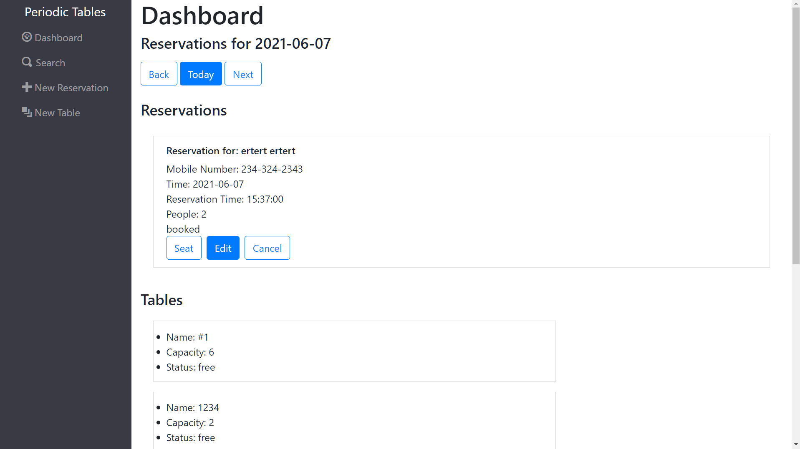
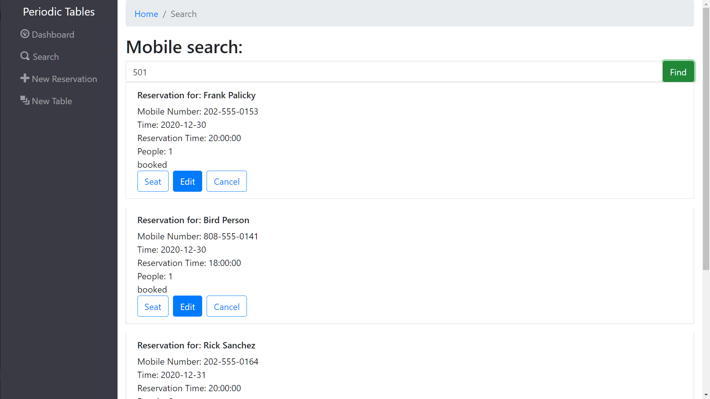
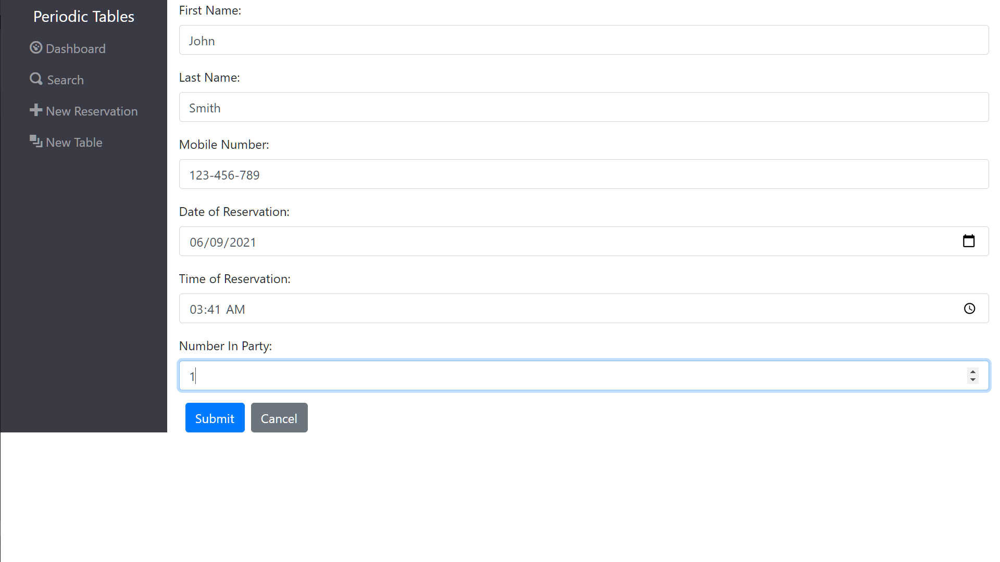

# Reservation Service App

This is app was built as a test reservation service. It was built using React, Bootstrap, Knex, Node, and Express.

# App images

### DASHBOARD

### NEW RESERVATION FORM

### RESERVATION ON DISPLAY, OCCUPIED TABLE & FINISH BUTTON ON TABLE

# API Documentation

### 1. Installation instructions

1. Fork or clone this repository
2. Run npm i
3. cd front-end && npm i
4. cd ../back-end && npm i
5. Create a .env file in the frontend directory. Update each url to the appropriate database URL
6. Modify `.env` with the following: 
   <code>
   &nbsp;DATABASE*URL=\_productionURL* 
   &nbsp;DATABASE*URL_DEVELOPMENT=\_developmentURL* 
   &nbsp;DATABASE*URL_TEST=\_testURL* 
   &nbsp;DATABASE*URL_PREVIEW=\_previewURL* 
   &nbsp;LOG_LEVEL=info 
   </code>
7. Create a `.env` file in the `frontend` directory.
8. Modify `.env` with the following: 
   <code>REACT_APP_API_BASE_URL=http://localhost:5000 </code>
9. From inside the backend directory, run `npx knex migrate:latest`.
10. Run `npx knex seed:run`.
11. Go back to the main directory and run `npm run start:dev` to run the application locally.

### 2. User Stories

This app is built for a manager.

###### US-01 Create and list reservations

I want to be able to make and view reservations.

###### US-02 Create reservation on a future, working date

We close on Tuesday and I also don't want reservations to accidentally be created in the past.

###### US-03 Create reservation within eligible timeframe

Make sure reservations are made for business hours and at least 60 minutes before closing.

###### US-04 Seat reservation

I want to be able to seat arrivals for a reservation to an open table, and be able to keep track of which tables are free or occupied.

###### US-05 Finish an occupied table

Once a reservation has been fulfilled, I want to be be able to close the reservation for future reservations.

###### US-06 Reservation Status

Reservations can be booked, seated, or finished. Finished reservations should be hidden from the display.

###### US-07 Search for a reservation by phone number

There should be a search function based off of a customer's phone number, either partial or complete.

###### US-08 Change an existing reservation

Reservations details (phone, name, party size, date, time) should be editable.

### 3. Functionality

App allows user to create and edit both tables and reservations.

### 4. Technology

- Front-End: HTML5, CSS3, JavaScript ES6, React
- Back-End: Node.js, Express.js, RESTful API Endpoints, Postgres
- Development Environment: DBeaver

### 5. Front-end Structure - React Components Map

- **Index.js**
  - **App.js**
    - **Layout.js**
      _ **Menu** -
      _**Dashboard**
      _**Search**
      _**New_Reservation**
      _**New_Table**
      _ **Routes** (stateful) -

### 6. API Documentation

| Endpoint                               | Method | Description                                          |
| -------------------------------------- | ------ | ---------------------------------------------------- |
| `/reservations`                        | GET    | Retrieves all existing reservation.                  |
| `/reservations`                        | POST   | Creates a new reservation.                           |
| `/reservations/:reservation_id`        | GET    | Gets the reservation with specific 'reservation_id'. |
| `/reservations/:reservation_id`        | PUT    | Updates the reservation.                             |
| `/reservations/:reservation_id/status` | PUT    | Updates the reservation status.                      |
| `/tables`                              | GET    | Retrieves all existing tables.                       |
| `/tables`                              | POST   | Creates a new table.                                 |
| `/tables/:tableId/seat`                | PUT    | Assigns a reservation to a table.                    |
| `/tables/:tableId/seat`                | DELETE | Clears a table for future use.                       |

##### Local React scripts

- To install the react project ===> npm install
- To run react (on port 3000) ===> npm start
- To run tests ===> npm run test

##### Local Node scripts

- To install the node project ===> npm install
- To Run backend node ===> npm run start
- To run tests ===> npm run test
